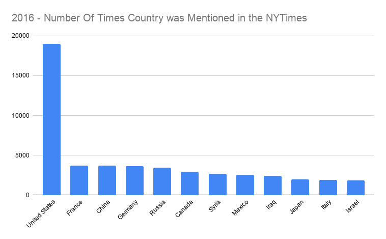
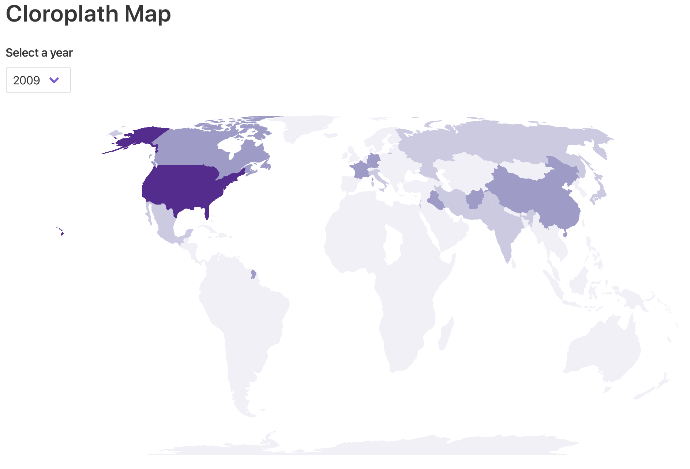
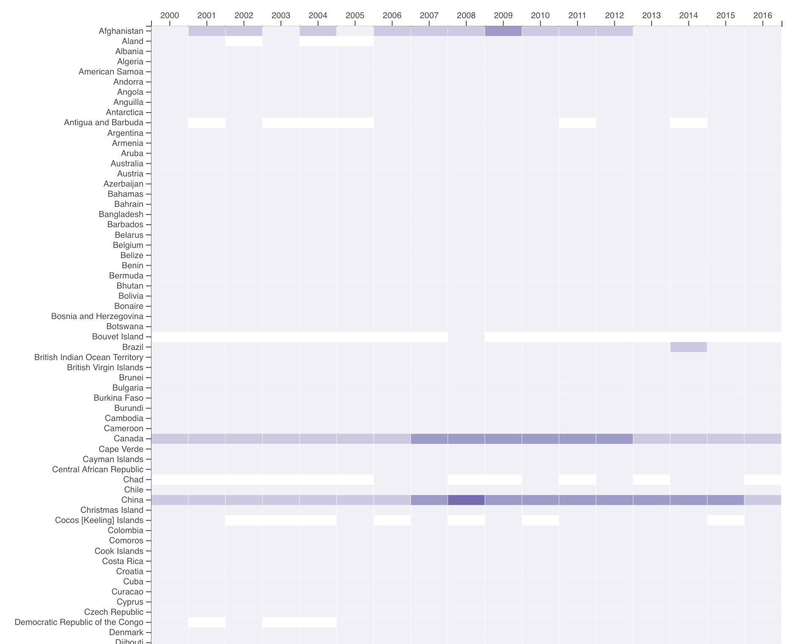

# data-viz-remix
Find the live website [here](http://kjmj.github.io/data-viz-remix/)

## Description and Screenshots

The goal of this project was to remix, or improve, an existing data visualization using d3.js.

When I found the original viz online, I was lucky enough to also find the dataset associated with it. That dataset can be found [here](https://data.world/ansakoy/countries-in-new-york-times-2000-2016). It is important to mention that the dataset kept track of the attention different countries received from the NY Times in different years. They measured this by counting the number of articles published by the NY Times where a particular country is mentioned.

Keep in mind that this data isn’t normalized or anything, and number of mentions might not be an excellent metric to deduce conclusions from. However, I think that the metric has validity when we are trying to understand why a country was mentioned more than normal during a certain year when compared to other years.

### Original Viz

Here is the original viz. It shows the number of times a country was mentioned in the NY Times for the year 2016. I felt that a choropleth map and heatmap were charts better suited to this data.



### Choropleth Map - My Remix #1

Here is the choropleth map I created. You can select a year, and the countries will be colored darker if they have been mentioned in the NY Times more, and lighter if there were less mentions.



### Heatmap - My Remix #2

Here is the heatmap I created. You can explore the data by hovering over a cell and getting the year/country/count of times mentioned in the NY Times. The heatmap is useful for determining outliers in our data.



## Build Setup

```bash
# install dependencies
$ yarn install

# serve with hot reload at localhost:3000
$ yarn dev

# build for production and launch server
$ yarn build
$ yarn start

# generate static project
$ yarn generate

# deploy site to github pages
$ yarn generate:gh-pages
$ yarn deploy

```

For detailed explanation on how things work, check out [Nuxt.js docs](https://nuxtjs.org).
